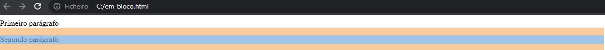
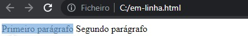
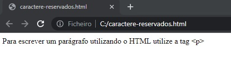
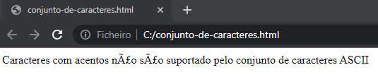

# HTML (Hyper Text Markup Language/Linguagem de marcação de hipertexto)

O HTML é a linguagem de marcação padrão dos websites. Ele é utilizado para descrever a estrutura das páginas através de uma série de elementos, que são definidos por tags, e que visa informar ao navegador como mostrar o conteúdo da página.

> Atenção: O HTML é uma tecnologia que básica para a criação de páginas de websites, porém para a criação de um site completo é necessário o utilizar juntamente com outras tecnologias como CSS e JavaScript 🤓 \
> Mas tenha calma "Não dá para ter o resultado sem viver todo o processo. Não apresse as coisas, viva um passo de cada vez." 🧘

> Arquivo: index.html

```html
<!DOCTYPE html>
<html lang="pt-br">
  <head>
    <meta charset="utf-8" />
    <title>Título da página do site</title>
  </head>
  <body>
    <h1>Titulo principal da página</h1>
    <p>Um parágrado simples relacionado ao conteúdo do website</p>
  </body>
</html>
```

> Resultado do arquivo acima aberto no navegador


## Índice

<details>
  <summary><a href="#conceitos-básicos">Conceitos básicos</a></summary>

&emsp;&emsp;[Editores](#editores)\
&emsp;&emsp;[Tags](#tags)\
&emsp;&emsp;[Aninhamento](#aninhamento)\
&emsp;&emsp;[Elementos](#elementos)\
&emsp;&emsp;[Atributos](#atributos)\
&emsp;&emsp;[Semântica](#semântica)\
&emsp;&emsp;[Espaço ocupado pelos elementos](#espaço-ocupado-pelos-elementos)\
&emsp;&emsp;[Caracteres reservados](#caracteres-reservados)\
&emsp;&emsp;[Conjunto de caracteres](#conjunto-de-caracteres) \
&emsp;&emsp;...Navegadores

</details>

<details>
  <summary>Estrutura básica</summary>

&emsp;&emsp;[doctype](#doctype) \
&emsp;&emsp;[html](#html) \
&emsp;&emsp;[head](#head) \
&emsp;&emsp;[body](#body)

</details>

<details>
  <summary>Tags, suas utilidades e exemplos</summary>

&emsp;&emsp;...em progresso

</details>

<details>
  <summary>Conteúdo relevante</summary>

&emsp;&emsp;...em progresso

</details>

<a href="#referências">Referências</a>

## Conceitos básicos

Os conceitos básicos é a seção de conceitos/informações que _EU_ considero fundamentais para o devido entendimento da tecnologia e que fazem com o que desenvolvedor tenha a consciencia de o que é o que e da real necessidade de cada informação

<p align="right"><a href="#índice">voltar ao índice ⬆️ </a></p>

### Editores

Para escrever arquivos HTML qualquer editor de texto serve, desde algo mais simples como o bloco de notas até algo mais robusto como uma [IDE(Integrated development environment/Ambiente de desenvolvimento integrado)](https://aws.amazon.com/pt/what-is/ide/#:~:text=Um%20ambiente%20de%20desenvolvimento%20integrado,uma%20aplica%C3%A7%C3%A3o%20f%C3%A1cil%20de%20usar.) que auxilia o desenvolvedor de diversas maneiras diferentes

<p align="right"><a href="#índice">voltar ao índice ⬆️ </a></p>

### Tags

As tag funcionam como etiquetas que descrevem como o conteúdo deve ser interpretado pelo navegador. As tags possuem duas formas:

- Com fechamento: Nesse formato ela funciona como um container e é sempre utilizada em pares, no qual a primeira tag é a de abertura a segunda tag é a de fechamento e o conteúdo do qual ela descreve se encontra entre elas

```html
<p>Conteúdo</p>
```

> Nota: A tag de abertura nesse exemplo é &lt;p&gt; e a tag de fechamento é &lt;/p&gt;. A tag de fechamento sempre será igual a tag de abertura porém com / nela

- Sem fechamento: Nesse caso a tag não funciona como um container possuindo um conteúdo. Ela tem a finalidade de ser o próprio conteúdo e descrever a si mesma

```html

```

> Nota: Não é necessário o / no final de tags sem fechamento. Porém muitos desenvolvedores utilizam como boa prática

> Atenção: As tags não fazem diferenciação entre maiúsculas e minúsculas, ou seja, a tag &lt;P&gt; e &lt;p&gt; significam a mesma coisa

<p align="right"><a href="#índice">voltar ao índice ⬆️ </a></p>

### Aninhamento

A estrutura de um arquivo HTML é repleta de Tags, porém esta Tags muitas delas são aninhadas uma nas outras criando uma estrutura análoga a de uma árvore genealógica

```html
<html>
  <body>
    <h1>Título</h1>
    <p>Parágrafo</p>
  </body>
</html>
```

- &lt;html&gt; é a tag raiz de da estrutura de exemplo acima
- &lt;body&gt; é a tag filha de &lt;html&gt;
- &lt;h1&gt; e &lt;p&gt; são tags irmãs, filhas de &lt;body&gt; e netas de &lt;html&gt;

> Nota: Essa associação da estrutura do arquivo HTML com uma árvore genealógica é de extrema utilidade e o auxiliará no aprendizado de outras tecnologias também

<p align="right"><a href="#índice">voltar ao índice ⬆️ </a></p>

### Elementos

Um elemento HTML é um conceito um pouco abstrato, porém simples, mas mesmo assim deve ser entendido com cuidado. Os elementos HTML também possuem duas formas e tem relação direta com as tags:

- Elemento simples: É definido por suas Tags(com fechamento) e TUDO entre elas, ou seja o elemento em si é a tag de abertura, o conteúdo e a tag de fechamento

```html
<!-- Exemplo de elemento simples -->
<p>Conteúdo</p>
```

```html
<!-- Outro exemplo de elementos simples porém aninhados -->
<body>
  <h1>Título</h1>
  <p>Parágrafo</p>
</body>
```

> Nota: "&lt;body&gt;...&lt;/body&gt;" é um elemento que possui mais dois elementos dentro "&lt;h1&gt;Título&lt;/h1&gt;" e "&lt;p&gt;Parágrafo&lt;/p&gt;"

> Nota: Elementos simples podem ser categorizados como semântico ou não semântico, mas isso será tratado mais a frente em [Semântica](#semântica)

- Elemento vazio: É o elemento definido por uma tag sem fechamento da qual a tag tem a finalidade de ser o próprio conteúdo

```html
<!-- Exemplo de elemento vazio -->

```

```html
<!-- Outro exemplo de elementos simples porém aninhados com um elemento vazio entre eles -->
<body>
  <h1>Título</h1>
  <br />
  <p>Parágrafo</p>
</body>
```

<p align="right"><a href="#índice">voltar ao índice ⬆️ </a></p>

### Atributos

Os atributos são dados definidos por chave e valor(chave-do-atributo="valorDoAtributo") que vão juntamente com a tag de abertura e que tem o objetivo de adicionar mais informações ao elemento HTML. Qualquer elemento pode ter atributos, existem até mesmo alguns atributos que são globais(que podem ser utilizado em qualquer elemento)

```html

```

- A tag do elemento é a &lt;img&gt;
- Ela possuí 3 atributos diferentes src, width e height
- src é o atributo que define a imagem a ser renderizada
- width é o atributo que define a largura que a imagem irá ter
- height é o atributo que define a altura que a imagem irá ter
- alt é o atributo que define a um texto alternativo que será utilizado caso a imagem não possa ser carregada por algum motivo

<p align="right"><a href="#índice">voltar ao índice ⬆️ </a></p>

### Semântica

Os elementos simples do HTML podem ser categorizados como semântico e não semântico. O que siginifica de fato é que existem algumas tags que ao serem utilizadas para a a criação de um elemento acabam não dando o devido significado aquele elemento. Por exemplo:

```html
<div id="feed">
  <div id="titulo">Titulo</div>
  <div id="paragrafo">Parágrafo</div>
</div>
```

No exemplo acima, ao invés de utilizar tags que melhor descrevem o elemento do qual ela faz parte. O desenvolvedor decidiu utilizar a tag &lt;div&gt; que não possue nenhum valor semântico, ou seja, uma tag não semântica. Porém o mesma situação poderia ter sido tratada de uma maneira diferente com a escolha de tags que fizessem o elemento ter um significado sem a necessidade do atributo "id"

```html
<article>
  <h1>Titulo</h1>
  <p>Parágrafo</p>
</article>
```

- &lt;article&gt;: Tag utilizada para a criação de um conteúdo que independente, que possuí todos as referências dele mesmo.
- &lt;h1&gt;: Tag utilizada para a criação de títulos onde pode variar de h1 até h6. h1 é para o título mais importante e h6 para o título menos importante
- &lt;p&gt;: Tag utilizada para a criação de parágrafos

Dessa forma a sua página obterá todos os benefícios disponibilizado pela escrita semântica do HTML como:

- Os mecanismos de pesquisa considerarão seu conteúdo como palavras-chave importantes para influenciar os rankings de pesquisa da página (veja [SEO](https://developer.mozilla.org/pt-BR/docs/Glossary/SEO))
- Os leitores de tela podem usá-lo como uma placa de sinalização para ajudar usuários com deficiência visual a navegar em uma página
- Encontrar blocos de código importantes é significativamente mais fácil do que procurar divs sem fim, com ou sem classes de semântica ou de nome espaçado.

<p align="right"><a href="#índice">voltar ao índice ⬆️ </a></p>

### Espaço ocupado pelos elementos

Ao exibir um elemento o navegador já sabe o o tamanho que ele deve ocupar na tela. Esses tamanhos padrões irão depender do tipo de elemento que ele é, podendo variar entre duas opções: em bloco(block) ou em linha(inline)

- Em bloco: Um elemento criado utilizando a tag &lt;p&gt; tem a exibição padrão definida como em bloco. O que significa que ele irá utilizar toda a largura da tela mesmo que não necessite

```html
<p>Primeiro parágrafo</p>
<p>Segundo parágrafo</p>
```

> Resultado do arquivo acima aberto no navegador



- Em linha: Um elemento criado utilizando a tag &lt;span&gt; tem a exibição padrão definida como em linha. O que significa que ele irá utilizar apenas a largura necessária para exibir o elemento

> Nota: A linha em azul é o espaço "utilizado" pelo elemento. As linhas amarelas são margins, não é relevante no momento. Observe que mesmo o texto do parágrafo sendo curto, ainda assim o elemento ocupa toda a largura da tela

```html
<span>Primeiro parágrafo</span> <span>Segundo parágrafo</span>
```

> Resultado do arquivo acima aberto no navegador



> Nota: A linha em azul é o espaço "utilizado" pelo elemento.Observe que mesmo o espaço ocupado pelo elemento é apenas o necessário para exibir o texto

<p align="right"><a href="#índice">voltar ao índice ⬆️ </a></p>

## Caracteres reservados

Existem alguns caracteres que são reservados na linguagem, e para utilizar esses caracteres deve-se utilizar o seu nome de entidades ou o seu número de entidade ao invés do caracter. Por exemplo:

- O símbolo < é reservado da linguagem, ou seja para o escrever eu preciso escrever seu nome de entidade "lt"(less than) entre os símbolos & e ; desta forma: \&lt; ou escrever seu número de entidade "60" entre os símbolos &, # e ; desta forma \&#60; e então, ao ser intepretado pelo navegador será mostrado <

```html
<p>Para escrever um parágrafo utilizando o HTML utilize a tag &lt;p&gt;</p>
```

> Resultado do arquivo acima aberto no navegador



<p align="right"><a href="#índice">voltar ao índice ⬆️ </a></p>

## Conjunto de caracteres

O conjunto de caracteres serve para informar ao navegador como interpretar os caracteres utilizados na página web. Atualmente o conjunto de caracteres padrão do HTML 5 é o UTF-8 que já suporta praticamente todos os caracteres do mundo, porém irei utilizar o conjunto antigo para fins de exemplificação

```html
<html>
  <head>
    <meta charset="ASCII" />
  </head>
  <body>
    <p>
      Caracteres com acentos não são suportado pelo conjunto de caracteres ASCII
    </p>
  </body>
</html>
```

- A tag **meta** com o atributo **charset** define o conjunto utilizado

> Resultado do arquivo acima aberto no navegador



<p align="right"><a href="#índice">voltar ao índice ⬆️ </a></p>

## Estrutura básica

### doctype

Todos os arquivos HTML devem iniciar com &lt;!DOCTYPE&gt;. \
Essa declaração não é uma tag HTML. Ela na verdade funciona como uma "informação" para o navegador sobre o tipo esperado do documento. \
No HTML 5 a declaração do &lt;!DOCTYPE&gt; é simples:

```html
<!DOCTYPE html>
```

> Nota: A declaração do &lt;!DOCTYPE&gt; Não diferencia maiúsculas de minúsculas

<p align="right"><a href="#índice">voltar ao índice ⬆️ </a></p>

### html

A tag &lt;html&gt; representa a raiz de um documento HTML. Ela funcionar como um container no qual **TODOS** outros elementos HTML dever ir dentro (exceto a declaração do &lt;!DOCTYPE&gt;).

```html
<!DOCTYPE html>
<html lang="pt-br">
  ...qualquer outro elemento HTML
</html>
```

> Nota: Você deve sempre incluir o atributo "lang" dento da tag &lt;html&gt;, para que o navegador entenda a linguagem da página. Isso se destina a ajudar os motores de busca e navegadores

<p align="right"><a href="#índice">voltar ao índice ⬆️ </a></p>

### head

A tag &lt;head&gt; é um container para metadados(dados relacionados a dados) e é colocada dentro do &lt;html&gt; e ao lado de &lt;body&gt;. \
Os metadados normalmente descrevem o titulo do página, o conjunto de caracteres, folhas de estilo, scripts, e outras informações dos dados.

```html
<!DOCTYPE html>
<html lang="pt-br">
  <head>
    ...tags HTML de metadados
  </head>
</html>
```

<p align="right"><a href="#índice">voltar ao índice ⬆️ </a></p>

### body

O elemento &lt;body&gt; contém todos conteúdo mostrado na página, como títulos, parágrafos, imagens, hiperlinks, tabelas, listas, etc.

```html
<!DOCTYPE html>
<html lang="pt-br">
  <body>
    ...Any other HTML content tag
  </body>
</html>
```

> Nota: Pode haver apenas um elemento &lt;body&gt; no arquivo HTML

<p align="right"><a href="#índice">voltar ao índice ⬆️ </a></p>

## Referências

- [w3schools](https://www.w3schools.com/html/default.asp)
- [betrybe](https://blog.betrybe.com/desenvolvimento-web/comandos-e-tags-html/)
- [amazon](https://aws.amazon.com/pt/what-is/ide/#:~:text=Um%20ambiente%20de%20desenvolvimento%20integrado,uma%20aplica%C3%A7%C3%A3o%20f%C3%A1cil%20de%20usar)
- [MDN web docs](https://developer.mozilla.org/pt-BR/docs/Glossary/Semantics)

<p align="right"><a href="#índice">voltar ao índice ⬆️ </a></p>
